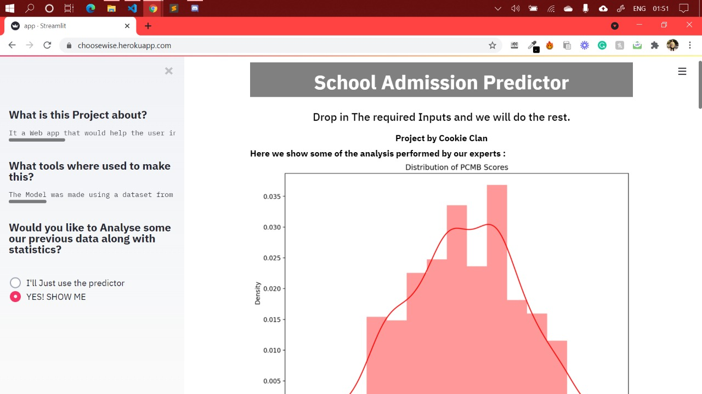
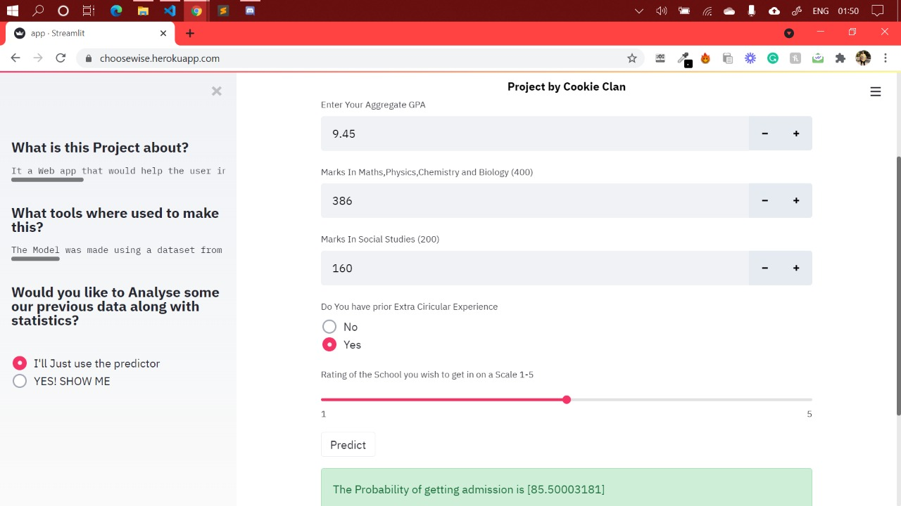

# Submission by Cookie Clan for MozoHack 2.1
Entry of Cookie Clan, from SRM Institute of Science and Technology, Kattankulathur, to MozoHack 2.1.

<h2 align= "left"><b>Tracks and Problem Statement</b></h2>

Track : Education and sports

Our Approach : During this pandemic ,all have been in constant stalemate with and are also afraid to step out due to this
pandemic, this is a reason we are providing an AID to the hectic admission process for a parent in a
virtual medium. So, our idea is to provide a platform that will compare various schools in that
region and help people get what they exactly want. The entire admission process will be virtual so that
they need not go for any physical meetups from school to school and can get best by sitting at their
home.
This idea will save time, will be less hectic for parents, will give the best for the student, will help to avoid
physical presence at any unknown place, and will make this task easier and simpler.

<h2 align= "left"><b>Our Product - ChooseWise(A Preview)</b></h2>

ChooseWise has three-interfaces: the Main Website, the SmartPredict and a Versatile Chatbot

<h4 align= "left"><b>ChooseWise Website</b></h4>

Our website will be holding a list of schools for that particular region now parents can select any school to
view the details such as school infrastructure, ratings, about the school activities, its reviews, its
achievements and fee structure as well.With a proficient search feature After comparing different schools under the same platform any parent can be sure as to
which school he should opt for.

<h4 align= "left"><b>SmartPredict</b></h4>

 &ensp;
 &ensp;

It is a web-app that makes use of Machine learning inorder to determine whether a student will be able to get into the School Admission Process based on metrics such as their PCMB scores, SS scores, their CGPA and other relevant information. Also, there is a detailed Analysis of past records and data for the parents to witness so that they choose the best for their children.

<h4 align= "left">Versatile Chatbot<b></b></h4>

A versatile and helpful chatbot will be present on our webpage for the aid of the users.Best feature of the bot is that it listens to your audio and responds accordingly.This makes it hands free and helps it to function without texting.A feature which increases our communication with the users.

<h2 align= "left"><b>Have Fun With Our Product</b></h2>

- Website Link : DEMO

<h2 align= "left"><b>Tech Stack Used</b></h2>

*Web*
- eJS,CSS,Bootstrap
- jQuery,notifyJS
- NodeJS,expressJS
- Firebase Storage

*Machine Learning*
- Python
- Numpy,Pandas,Matplotlib,Seaborn and Scikit-Learn
- Streamlit 

*Chatbot*
- JavaScript
- Webkit speech recognition api

<h2 align= "left"><b>Project Maintainer(s)</b></h2>

<table>
<tr align="center">
  
  <td>
Suvodeep Sinha

</td>

<td>

Mohammad Muazam

</td>

<td>
  
 <td>

Mayukh Mousam Mishra

</td>

<td>

<td>

Yash Joshi

</td>
</tr>

  </table>

## License

